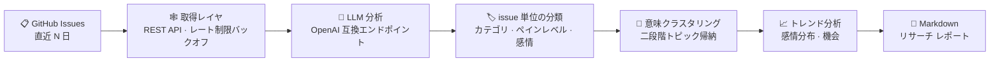

<div align="center">


# 🛰️ gh-pain-intel · Open-Source Community Pain-Point Intelligence

**GitHub Issue のペインポイントを監視 → LLM による深い意味分析 → マーケットリサーチ レポートをワンクリックで書き出し**

[](https://github.com/Mocas-12/gh-pain-intel/actions/workflows/ci.yml)
[](https://www.python.org)
[](https://streamlit.io)
[](#-マルチllm-切替)
[](#-デイリー-star-成長ボード)
[](LICENSE)

**[🌐 ライブダッシュボード (Streamlit Cloud)](https://gh-pain-intel-8egvafff3urokytzxa63x2.streamlit.app/)**

[English](./README.md) | [简体中文](./README.zh-CN.md) | **日本語**

*リポジトリを入力 → 直近の issue を取得 → マルチモデル分析 → 構造化レポートを書き出し*

公開データの読み取り専用 · 社内リサーチ用

</div>

---

## 📖 目次

- [特徴](#-特徴)
- [仕組み](#-仕組み)
- [デイリー Star 成長ボード](#-デイリー-star-成長ボード)
- [マルチ LLM 切替](#-マルチllm-切替)
- [プロジェクト構成](#-プロジェクト構成)
- [クイックスタート](#-クイックスタート)
- [設定](#-設定)
- [GITHUB_TOKEN の作り方](#-github_token-の作り方)
- [FAQ](#-faq)
- [コンプライアンスとセキュリティ](#-コンプライアンスとセキュリティ)
- [開発 & 品質](#-開発--品質)
- [ライセンス](#-ライセンス)

## ✨ 特徴

- 🔎 **ペインポイント分類**：issue ごとの意味分類（bug / feature / question / doc / other）+ 1〜5 段階の痛みの深刻度 + 感情タグ付け
- 🧩 **トピック クラスタリング**：二段階の意味クラスタリング（バッチ要約 → 全体マージ）で、深刻度と代表引用付きの 5〜12 トピック クラスタを蒸留
- 📈 **トレンド分析**：開発者感情の分布、上昇中のホット トピック、コミュニティ リスク シグナル、プロダクトの機会
- 🔀 **マルチ LLM 切替**：13 プリセット——OpenRouter / OpenAI / Gemini / Claude / DeepSeek / Kimi / 智譜 / 通義 / Grok など。OpenAI 互換エンドポイントならそのまま接続可能
- 🔥 **デイリー Star 成長ボード**：ホームには常に GitHub 公式 Trending の「stars today」Top 10 を表示。毎日自動更新 + オンデマンドの手動更新。ワンクリックで分析対象リポジトリへ追加
- 📄 **ワンクリック レポート**：3 セクション構成の Markdown マーケットリサーチ レポート——数値はすべてローカル計算で検証可能
- ⚡ **並列バッチ処理**：分類はスレッド プール並列 + 429/5xx に指数バックオフ。失敗バッチはデフォルトへフォールバックしパイプラインを止めず、無効キー / 誤モデル名は読めるエラーで即フェイルファスト
- 🖥️ **2 つのエントリ ポイント**：対話型 Streamlit ダッシュボード + ヘッドレス CLI バッチ（Windows のタスク スケジューラに対応）

## 🧠 仕組み



1. **取得**：GitHub REST API が対象リポジトリの直近 N 日の issue と主要コメントを取得し、PR を除外、ホット度でソート、レート制限時は自動バックオフ（Retry-After）
2. **分類**：issue テキストを選択した LLM へ並列バッチ送信し、構造化 JSON の返却を強制（カテゴリ / ペインレベル / 感情 / 中文サマリ）。解析失敗時は自動リトライ
3. **クラスタリング**：全分類サマリを二段階でトピック クラスタに帰納（名称 / 出現数 / 深刻度 / 代表引用 / 一行インサイト）
4. **分析 & 生成**：感情分布をトレンド分析へ集約し、「高頻度ペインポイント / 機能要望 / 感情とトレンド」の 3 セクション レポートへ組み立て

## 🔥 デイリー Star 成長ボード

ホーム上部の「🔥 Today's STAR Growth TOP 10」カード グリッド（デフォルト展開）には、GitHub 公式 Trending の**直近 1 日のスター獲得数**（`stars today`）が成長数の降順で表示されます——累計スター ランキングではありません。毎日更新されるため、いま伸びているリポジトリの発見に最適。タイトル横の ↻ 更新ボタンでキャッシュを迂回して強制再取得でき、カードの ➕ でワンクリック分析対象へ追加できます。

| 項目 | 詳細 |
| --- | --- |
| データソース | https://github.com/trending?since=daily （ページから取得。GitHub API クォータを消費せず、トークン不要） |
| 更新間隔 | UTC 日付でキャッシュ。その日最初の起動時に 1 回取得——タイトル横の「↻」更新ボタンでいつでも強制再取得 |
| フォールバック | ページ構造が変わった場合は「ボード一時利用不可」と表示され、他の機能には影響しない |

## 🔀 マルチ LLM 切替

「モデル設定」で主要 LLM をワンクリック切替：すべて **OpenAI Chat Compatibles 互換プロトコル**で統一されています。プロバイダを切り替えると公式エンドポイントとデフォルト モデルが自動入力され、各キーの取得先は入力欄のヘルプ テキストを参照してください。

| プロバイダ | エンドポイント | キー環境変数 |
| --- | --- | --- |
| OpenRouter（デフォルト · Ox Alpha） | `https://openrouter.ai/api/v1` | `OPENROUTER_API_KEY` |
| OpenAI | `https://api.openai.com/v1` | `OPENAI_API_KEY` |
| Google Gemini | `…/v1beta/openai`（公式互換エンドポイント） | `GEMINI_API_KEY` |
| Anthropic Claude | `https://api.anthropic.com/v1`（公式互換レイヤ） | `ANTHROPIC_API_KEY` |
| DeepSeek | `https://api.deepseek.com/v1` | `DEEPSEEK_API_KEY` |
| Moonshot (Kimi) | `https://api.moonshot.cn/v1` | `MOONSHOT_API_KEY` |
| 智譜 GLM | `https://open.bigmodel.cn/api/paas/v4` | `ZHIPU_API_KEY` |
| 通義千問（百煉） | `…/compatible-mode/v1` | `DASHSCOPE_API_KEY` |
| xAI (Grok) | `https://api.x.ai/v1` | `XAI_API_KEY` |
| SiliconFlow | `https://api.siliconflow.cn/v1` | `SILICONFLOW_API_KEY` |
| Groq | `https://api.groq.com/openai/v1` | `GROQ_API_KEY` |
| Ollama（ローカル · 無料） | `http://localhost:11434/v1` | キー不要 |
| カスタム | 任意の OpenAI 互換エンドポイント | `LLM_API_KEY`（任意） |

> - モデル名は変化が速い：ドロップダウンは主要プリセットのみ——「✏️ Other（手動入力）」を選べば任意のモデル名を入力できます
> - 新しいプロバイダの追加は `src/llm_providers.py` に 1 行書くだけ（エンドポイント + モデル + キー環境変数名）

## 📁 プロジェクト構成

```text
gh-pain-intel/
├── app.py                    # Streamlit ダッシュボード：成長ボード + メトリック カード + 3 セクション タブ + レポート ダウンロード
├── cli.py                    # ヘッドレス バッチ エントリ（--provider でモデル切替）
├── src/
│   ├── scraper.py            # 取得レイヤ：REST API · レート制限バックオフ · PR 除外 · ホット度ソート · コメント コンテキスト
│   ├── trending.py           # Trending レイヤ：GitHub Trending の「stars today」を解析 → デイリー成長 Top 10
│   ├── llm_providers.py      # プロバイダ レジストリ：主要 13 LLM のエンドポイント / モデル / キー プリセット
│   ├── ai_engine.py          # 分析レイヤ：並列分類 → 二段階クラスタリング → トレンド分析（厳格 JSON + リトライ）
│   ├── report.py             # レポート レイヤ：3 セクション Markdown 組み立て（数値はローカル計算で検証可能）
│   └── ui.py                 # UI レイヤ：深宇宙司令室風コンポーネント（ガラス風カード / グラデーション タイトル）
├── tests/                    # オフライン単体テスト（50 用例、ネットワークなし）、CI で強制
├── .github/workflows/ci.yml  # GitHub Actions：ruff + 単体テスト（Python 3.11-3.13）
├── run_weekly.bat            # Windows 定期タスク スクリプト
├── e2e_run.py                # E2E スモーク スクリプト
├── pyproject.toml            # プロジェクト メタデータ + ruff 設定
├── requirements.txt          # ランタイム依存（バージョン固定）
└── requirements-dev.txt      # 開発/CI ツールチェーン（ランタイム依存 + ruff）
```

## 🚀 クイックスタート

```bash
git clone https://github.com/Mocas-12/gh-pain-intel.git
cd gh-pain-intel
pip install -r requirements.txt
streamlit run app.py
```

> ローカル実行では、キーをプロジェクト ルートの `.env` に書いてください（gitignore 済み）。エンジンが起動時に自動で読み込みます。
> コントリビュータのセットアップ：`pip install -r requirements-dev.txt`（ランタイム依存 + CI と同じ ruff）。

| コマンド | 説明 |
| --- | --- |
| `streamlit run app.py` | Web ダッシュボードを起動 |
| `python cli.py --repos ollama/ollama,vllm-project/vllm --days 7 --out report.md` | ヘッドレス バッチ。定期タスクに最適 |
| `python cli.py --provider gemini --repos ollama/ollama --days 7` | CLI からモデルを切替 |
| `python -m unittest discover -s tests -v` | オフライン単体テストを実行 |
| `ruff check .` | Lint チェック（CI と同一） |

## ⚙️ 設定

| 変数 | 説明 |
| --- | --- |
| `GITHUB_TOKEN` | GitHub PAT。クォータが 60 回/時 から 5,000 回/時 に上がる（[下のチュートリアル参照](#-github_token-の作り方)） |
| `OPENROUTER_API_KEY` | デフォルト プロバイダ OpenRouter のキー（https://openrouter.ai/keys） |
| `OPENROUTER_MODEL` / `OPENROUTER_BASE_URL` | OpenRouter のモデル / エンドポイント上書き（レガシー互換） |
| `LLM_API_KEY` | 汎用キーのフォールバック。`OPENROUTER_API_KEY` より優先（カスタム エンドポイントと併用が一般的）。注意：CLI（`cli.py`）は逆の順序で解決——`OPENROUTER_API_KEY` が `LLM_API_KEY` より優先 |
| `LLM_PROVIDER` | CLI のデフォルト プロバイダ（例：`gemini`、`deepseek`）。UI での手動切替には影響しない |
| プロバイダ固有キー | `OPENAI_API_KEY`, `GEMINI_API_KEY`, `ANTHROPIC_API_KEY`, `DEEPSEEK_API_KEY`, `MOONSHOT_API_KEY`, `ZHIPU_API_KEY`, `DASHSCOPE_API_KEY`, `XAI_API_KEY`, `SILICONFLOW_API_KEY`, `GROQ_API_KEY` — UI で該当プロバイダを選ぶと自動入力 |

クラウド デプロイ（Streamlit Cloud）では **Manage app → Settings → Secrets** から資格情報をサーバ側に注入——訪問者には見えません。実際に使うプロバイダだけ設定してください：

```toml
GITHUB_TOKEN = "ghp_你的token"
OPENROUTER_API_KEY = "sk-or-v1-…"
GEMINI_API_KEY = "AIza…"        # 用到哪家配哪家
```

## 🔑 GITHUB_TOKEN の作り方

> なくても動きますが、匿名クォータは **60 リクエスト/時**で IP 共有（クラウド デプロイではほぼ即座に枯渇）；
> トークンを設定すれば **5,000 リクエスト/時** に上がります。所要は約 1 分。

1. GitHub にサインイン → **https://github.com/settings/tokens** を開く
2. **"Generate new token" → "Generate new token (classic)"** をクリック
3. 入力は 2 項目だけ：
   - **Note**：任意の名前。例：`gh-pain-intel`
   - **Expiration**：有効期間。`90 days` か `No expiration` を推奨
4. ⬇️ **権限スコープは一切チェック不要**——このツールは公開データを読むだけです
5. ページ下部の緑の **"Generate token"** ボタンをクリック
6. **トークンをすぐコピー**（`ghp_` で始まる。この一度しか表示されません！）
7. 設定に書き込む（どちらか）：
   - ローカル：プロジェクト ルートの `.env` に 1 行追加
     ```ini
     GITHUB_TOKEN=***
     ```
   - クラウド：アプリ右下の **Manage app → Settings → Secrets** に追加
     ```toml
     GITHUB_TOKEN = "ghp_你的token"
     ```

> ✅ セキュリティ注記：このトークンはあなたのアカウントに見える公開データを読めるだけで、リポジトリへの書き込みや変更はできません；
> もし漏洩したら同じページに戻って Delete し、新しいものを生成すれば OK です。

## ❓ FAQ

<details>
<summary><b>GitHub クォータ枯渇 / クラウド取得の失敗</b></summary>

- 匿名クォータは 60 リクエスト/時で IP 共有。Streamlit の共有出口 IP では簡単に枯渇します
- 対処：<code>GITHUB_TOKEN</code> を設定（5,000 リクエスト/時 に向上）——上のチュートリアルを参照
</details>

<details>
<summary><b>ボードに「一時利用不可」と出る</b></summary>

- GitHub Trending のページ構造変更やネットワークの一時的な不調が原因
- 他の機能には影響しません。ボード タイトル横の「↻」更新ボタンで再試行——失敗しても前回のキャッシュを保持・表示します
</details>

<details>
<summary><b>分析が「N バッチの分類に失敗」と報告する</b></summary>

- ほとんどはモデル側のレート制限（429）。失敗バッチはすでにデフォルトへフォールバック済みで、他のサンプルには影響しません
- サイドバーの「同時リクエスト数」（例：2）や「バッチサイズ」を下げて再実行してみてください
</details>

<details>
<summary><b>一部のモデルが temperature パラメータ エラーを出す</b></summary>

- OpenAI の o シリーズなど推論モデルはデフォルト temperature のみ受け付けます
- 対処：「モデル設定」で Temperature を 1.0 に戻す
</details>

<details>
<summary><b>別のモデルで分析するには</b></summary>

- UI：サイドバーの「モデル設定」ドロップダウンでプロバイダとモデルを切替。公式エンドポイントは自動入力
- CLI：<code>python cli.py --provider gemini --repos …</code>
</details>

<details>
<summary><b>分析が HTTP 401/403 で失敗する</b></summary>

- API キーが無効、残高切れ、または選択モデルへのアクセス権なし——この種のエラーは即フェイルファストし、そのまま報告されます（「JSON 解析失敗」とは決して偽装されません）
- UI：「モデル設定」でキーを確認するかプロバイダを切替。CLI：対応する環境変数（例：<code>DEEPSEEK_API_KEY</code>）を確認
</details>

<details>
<summary><b>分析が HTTP 404 で失敗する</b></summary>

- ほとんどは <code>base_url</code> かモデル名の誤り——エンドポイントが OpenAI 互換プロトコルを話すこと、そのプロバイダにモデルが実在することを確認してください
</details>

## 🔒 コンプライアンスとセキュリティ

- 🔍 公開データの**読み取り専用**分析で**社内リサーチ レポート**を作るのみ——第三者プラットフォームへの自動投稿は一切なし
- ✍️ 引用されたコミュニティ テキストの著作権は元の著者に帰属
- 🔑 キーはローカルの `.env`（gitignore 済み）のみか、Streamlit Cloud Secrets 経由でサーバ側に注入。UI がキーを表示し返すことはない

## 🧪 開発 & 品質

エンジニアリング品質は規律ではなく CI で担保します：

- **CI**：push / PR ごとに `ruff check` + オフライン単体テスト全件（50 用例）を Python 3.11 / 3.12 / 3.13 で実行——[.github/workflows/ci.yml](.github/workflows/ci.yml) を参照
- **Lint**：[ruff](https://docs.astral.sh/ruff/) のルール `E4/E7/E9/F/B/UP`、[pyproject.toml](pyproject.toml) で設定——現在警告ゼロ。この状態を維持
- **依存**：ランタイム バージョンはフルスイートを通過する組み合わせに `requirements.txt` で固定。開発/CI ツールチェーンは `requirements-dev.txt`
- **Python**：`>= 3.11`（pandas 3.x の要求）
- **E2E**：`python e2e_run.py` が `pandas-dev/pandas` に対して実取得 + 完全なモデル パイプラインを実行（`OPENROUTER_API_KEY` が必要。意図的に手動実行のまま）

## 📄 ライセンス

[MIT License](./LICENSE) で公開。引用されたコミュニティ テキストの著作権は元の著者に帰属します。

---

<div align="center">

**Made with 🛰️ by [Mocas-12](https://github.com/Mocas-12)**

🌐 [ライブダッシュボード](https://gh-pain-intel-8egvafff3urokytzxa63x2.streamlit.app/) · 🐛 [Issue を報告](https://github.com/Mocas-12/gh-pain-intel/issues) · 📖 [リポジトリ ホーム](https://github.com/Mocas-12/gh-pain-intel)

</div>
