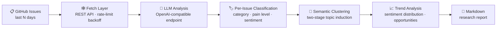

<div align="center">


# 🛰️ gh-pain-intel · Open-Source Community Pain-Point Intelligence

**Monitor GitHub issue pain points → deep LLM semantic analysis → export market research reports in one click**

[](https://www.python.org)
[](https://streamlit.io)
[](#-multi-llm-switching)
[](#-daily-star-growth-board)

**[🌐 Live Dashboard (Streamlit Cloud)](https://gh-pain-intel-8egvafff3urokytzxa63x2.streamlit.app/)**

**English** | [简体中文](./README.zh-CN.md)

*Enter repositories → fetch recent issues → multi-model analysis → export structured reports*

Read-only public data · for internal research use

</div>

---

## 📖 Table of Contents

- [Features](#-features)
- [How It Works](#-how-it-works)
- [Daily Star Growth Board](#-daily-star-growth-board)
- [Multi-LLM Switching](#-multi-llm-switching)
- [Project Structure](#-project-structure)
- [Quick Start](#-quick-start)
- [Configuration](#-configuration)
- [How to Create GITHUB_TOKEN](#-how-to-create-github_token)
- [FAQ](#-faq)
- [Compliance and Security](#-compliance-and-security)

## ✨ Features

- 🔎 **Pain-Point Classification**: per-issue semantic classification (bug / feature / question / doc / other) + pain severity on a 1-5 scale + sentiment tagging
- 🧩 **Topic Clustering**: two-stage semantic clustering (batch summarization → global merging), distilling 5~12 topic clusters with severity and representative quotes
- 📈 **Trend Analysis**: developer sentiment distribution, rising hot topics, community risk signals, and product opportunities
- 🔀 **Multi-LLM Switching**: 13 presets — OpenRouter / OpenAI / Gemini / Claude / DeepSeek / Kimi / Zhipu / Tongyi / Grok and more; any OpenAI-compatible endpoint plugs right in
- 🔥 **Daily Star Growth Board**: homepage always shows GitHub's official Trending "stars today" Top 10, refreshed every day; add a repo to your analysis targets with one click
- 📄 **One-Click Reports**: three-section Markdown market research reports — every number computed locally and verifiable
- ⚡ **Concurrent Batching**: thread-pool concurrency for classification + exponential backoff on 429/5xx; failed batches fall back to defaults without breaking the pipeline
- 🖥️ **Dual Entry Points**: interactive Streamlit dashboard + headless CLI batching (supports Windows scheduled tasks)

## 🧠 How It Works



1. **Fetch**: the GitHub REST API pulls issues and top comments from the last N days of the target repos, filters out PRs, sorts by hotness, and backs off automatically on rate limits (Retry-After)
2. **Classify**: issue text is batched concurrently to the selected LLM, forced to return structured JSON (category / pain level / sentiment / Chinese summary), with automatic retry on parse failures
3. **Cluster**: all classification summaries are induced in two stages into topic clusters (name / frequency / severity / representative quotes / one-line insight)
4. **Analyze & produce**: sentiment distributions are aggregated into trend analysis, then assembled into a three-section "high-frequency pain points / feature requests / sentiment and trends" report

## 🔥 Daily Star Growth Board

The "🔥 Today's STAR Growth TOP 10" card grid at the top of the homepage (expanded by default) shows the
**stars gained in the last day** (`stars today`) from GitHub's official Trending, sorted in descending order by
growth — not an all-time star ranking. The board refreshes every day, making it perfect for spotting repos that
are taking off right now. Click ➕ on a card to add the repo to your analysis targets with one click.

| Feature | Details |
| --- | --- |
| Data source | https://github.com/trending?since=daily (scraped from the page; consumes no GitHub API quota, no token needed) |
| Refresh cadence | Cached by UTC date; fetched once on the first app open each day |
| Fallback | If the page structure changes, shows "board temporarily unavailable" without affecting other features |

## 🔀 Multi-LLM Switching

"Model Settings" lets you switch between mainstream LLMs with one click: everything goes through the
**OpenAI Chat Completions compatible protocol**. Switching a provider automatically fills in its official
endpoint and default model; see the input help text for where to get each key.

| Provider | Endpoint | Key environment variable |
| --- | --- | --- |
| OpenRouter (default · Ox Alpha) | `https://openrouter.ai/api/v1` | `OPENROUTER_API_KEY` |
| OpenAI | `https://api.openai.com/v1` | `OPENAI_API_KEY` |
| Google Gemini | `…/v1beta/openai` (official compatible endpoint) | `GEMINI_API_KEY` |
| Anthropic Claude | `https://api.anthropic.com/v1` (official compatibility layer) | `ANTHROPIC_API_KEY` |
| DeepSeek | `https://api.deepseek.com/v1` | `DEEPSEEK_API_KEY` |
| Moonshot (Kimi) | `https://api.moonshot.cn/v1` | `MOONSHOT_API_KEY` |
| Zhipu GLM | `https://open.bigmodel.cn/api/paas/v4` | `ZHIPU_API_KEY` |
| Tongyi Qwen (Bailian) | `…/compatible-mode/v1` | `DASHSCOPE_API_KEY` |
| xAI (Grok) | `https://api.x.ai/v1` | `XAI_API_KEY` |
| SiliconFlow | `https://api.siliconflow.cn/v1` | `SILICONFLOW_API_KEY` |
| Groq | `https://api.groq.com/openai/v1` | `GROQ_API_KEY` |
| Ollama (local · free) | `http://localhost:11434/v1` | No key required |
| Custom | Any OpenAI-compatible endpoint | `LLM_API_KEY` (optional) |

> - Model names change quickly: the dropdown only lists common presets — choose "✏️ Other (manual input)" to enter any model name
> - Adding a new provider takes just one line in `src/llm_providers.py` (endpoint + model + key env var name)

## 📁 Project Structure

```text
gh-pain-intel/
├── app.py                    # Streamlit dashboard: growth board + metric cards + three-section tabs + report download
├── cli.py                    # Headless batch entry point (--provider to switch models)
├── src/
│   ├── scraper.py            # Fetch layer: REST API · rate-limit backoff · PR filtering · hotness sorting · comment context
│   ├── trending.py           # Trending layer: parses GitHub Trending "stars today" → daily growth Top 10
│   ├── llm_providers.py      # Provider registry: 13 mainstream LLM endpoint / model / key presets
│   ├── ai_engine.py          # Analysis layer: concurrent classification → two-stage clustering → trend analysis (strict JSON + retries)
│   ├── report.py             # Report layer: three-section Markdown assembly (numbers computed locally, verifiable)
│   └── ui.py                 # UI layer: deep-space command-center style components (glassmorphism cards / gradient titles)
├── tests/                    # Offline unit tests (27 cases, no network)
├── run_weekly.bat            # Windows scheduled-task script
├── e2e_run.py                # End-to-end smoke script
└── requirements.txt
```

## 🚀 Quick Start

```bash
git clone https://github.com/Mocas-12/gh-pain-intel.git
cd gh-pain-intel
pip install -r requirements.txt
streamlit run app.py
```

> For local runs, put your keys in a `.env` file at the project root (already gitignored); the engine loads it automatically at startup.

| Command | Description |
| --- | --- |
| `streamlit run app.py` | Launch the web dashboard |
| `python cli.py --repos ollama/ollama,vllm-project/vllm --days 7 --out report.md` | Headless batching, great for scheduled tasks |
| `python cli.py --provider gemini --repos ollama/ollama --days 7` | Switch models from the CLI |
| `python -m unittest discover -s tests -v` | Run the offline unit tests |

## ⚙️ Configuration

| Variable | Description |
| --- | --- |
| `GITHUB_TOKEN` | GitHub PAT; raises the quota from 60/hour to 5,000/hour ([see the tutorial below](#-how-to-create-github_token)) |
| `OPENROUTER_API_KEY` | Key for OpenRouter, the default provider (https://openrouter.ai/keys) |
| `OPENROUTER_MODEL` / `OPENROUTER_BASE_URL` | OpenRouter model / endpoint overrides (legacy compatibility) |
| `LLM_API_KEY` | Generic key fallback; takes priority over `OPENROUTER_API_KEY` (commonly used with custom endpoints) |
| `LLM_PROVIDER` | Default provider for the CLI (e.g. `gemini`, `deepseek`); does not affect manual switching in the UI |
| Provider-specific keys | `OPENAI_API_KEY`, `GEMINI_API_KEY`, `ANTHROPIC_API_KEY`, `DEEPSEEK_API_KEY`, `MOONSHOT_API_KEY`, `ZHIPU_API_KEY`, `DASHSCOPE_API_KEY`, `XAI_API_KEY`, `SILICONFLOW_API_KEY`, `GROQ_API_KEY` — auto-filled once the matching provider is selected in the UI |

Cloud deployment (Streamlit Cloud) injects credentials server-side via **Manage app → Settings → Secrets** — invisible to visitors; configure only the providers you actually use:

```toml
GITHUB_TOKEN = "ghp_你的token"
OPENROUTER_API_KEY = "sk-or-v1-…"
GEMINI_API_KEY = "AIza…"        # 用到哪家配哪家
```

## 🔑 How to Create GITHUB_TOKEN

> It works without one, but the anonymous quota is only **60 requests/hour** and shared by IP (cloud deployments exhaust it almost instantly);
> configuring a token raises it to **5,000 requests/hour**. The whole process takes about 1 minute.

1. Sign in to GitHub → open **https://github.com/settings/tokens**
2. Click **"Generate new token" → "Generate new token (classic)"**
3. Fill in just two fields:
   - **Note**: any name, e.g. `gh-pain-intel`
   - **Expiration**: validity period; `90 days` or `No expiration` recommended
4. ⬇️ **No permission scopes need to be checked at all** — this tool only reads public data
5. Click the green **"Generate token"** button at the bottom of the page
6. **Copy the token immediately** (starts with `ghp_`, shown only this once!)
7. Write it into your config (either one):
   - Local: add a line to the `.env` file in the project root
     ```ini
     GITHUB_TOKEN=***
     ```
   - Cloud: add it under **Manage app → Settings → Secrets** at the bottom-right of the app
     ```toml
     GITHUB_TOKEN = "ghp_你的token"
     ```

> ✅ Security note: this token can only read public data visible to your account and cannot write to or modify any repo;
> if it ever leaks, just go back to the same page, click Delete, and generate a new one.

## ❓ FAQ

<details>
<summary><b>GitHub quota exhausted / cloud fetch fails</b></summary>

- The anonymous quota is only 60 requests/hour and shared by IP; Streamlit's shared egress IP exhausts it easily
- Fix: configure <code>GITHUB_TOKEN</code> (raises it to 5,000 requests/hour) — see the tutorial above
</details>

<details>
<summary><b>The board shows "temporarily unavailable"</b></summary>

- Caused by GitHub Trending page-structure changes or network hiccups
- Other features are unaffected; refresh the page later and retry — the day's cache is not impacted
</details>

<details>
<summary><b>Analysis reports "N batches failed to classify"</b></summary>

- Usually model-side rate limiting (429); failed batches already fell back to defaults, and other samples are unaffected
- Try lowering "Concurrent requests" (e.g. 2) or "Batch size" in the sidebar and rerun
</details>

<details>
<summary><b>Some models throw a temperature parameter error</b></summary>

- Reasoning models like OpenAI's o-series only accept the default temperature
- Fix: set Temperature back to 1.0 in "Model Settings"
</details>

<details>
<summary><b>How to analyze with a different model</b></summary>

- UI: switch provider and model from the "Model Settings" dropdown in the sidebar; the official endpoint is filled in automatically
- CLI: <code>python cli.py --provider gemini --repos …</code>
</details>

## 🔒 Compliance and Security

- 🔍 **Read-only** analysis of public data, producing **internal research reports** — never auto-posts to any third-party platform
- ✍️ Quoted community text remains the copyright of its original authors
- 🔑 Keys live only in a local `.env` (gitignored) or are injected server-side via Streamlit Cloud Secrets; the UI never echoes them back

---

<div align="center">

**Made with 🛰️ by [Mocas-12](https://github.com/Mocas-12)**

🌐 [Live Dashboard](https://gh-pain-intel-8egvafff3urokytzxa63x2.streamlit.app/) · 🐛 [Report an Issue](https://github.com/Mocas-12/gh-pain-intel/issues) · 📖 [Repository Home](https://github.com/Mocas-12/gh-pain-intel)

</div>
