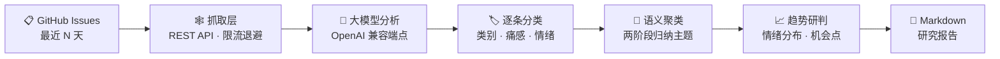

<div align="center">


# 🛰️ gh-pain-intel · 开源社区痛点情报中心

**监控 GitHub Issue 痛点 → 大模型深度语义分析 → 一键导出市场研究报告**

[](https://www.python.org)
[](https://streamlit.io)
[](#-多模型切换)
[](#-每日-star-增幅榜)

**[🌐 在线看板（Streamlit Cloud）](https://gh-pain-intel-8egvafff3urokytzxa63x2.streamlit.app/)**

[English](./README.md) | **简体中文**

*填入仓库 → 抓取近期 Issue → 多模型分析 → 导出结构化报告*

只读公开数据 · 内部研究用途

</div>

---

## 📖 目录

- [功能特性](#-功能特性)
- [工作原理](#-工作原理)
- [每日 Star 增幅榜](#-每日-star-增幅榜)
- [多模型切换](#-多模型切换)
- [项目结构](#-项目结构)
- [快速开始](#-快速开始)
- [配置说明](#-配置说明)
- [如何创建 GITHUB_TOKEN](#-如何创建-github_token)
- [常见问题](#-常见问题)
- [合规与安全](#-合规与安全)

## ✨ 功能特性

- 🔎 **痛点分类**：逐条 Issue 语义分类（bug / feature / question / doc / other）+ 痛感 1-5 分级 + 情绪标注
- 🧩 **主题聚类**：两阶段语义聚类（分批归纳 → 全局合并），提炼 5~12 个主题簇、严重度与代表性原话
- 📈 **趋势研判**：开发者情绪分布、热度上升话题、社区风险信号与产品机会点
- 🔀 **多模型切换**：OpenRouter / OpenAI / Gemini / Claude / DeepSeek / Kimi / 智谱 / 通义 / Grok 等 13 家预设，任意 OpenAI 兼容端点即插即用
- 🔥 **每日 Star 增幅榜**：主页常驻 GitHub 官方 Trending「stars today」增幅 Top 10，每天换血，一键追加分析目标
- 📄 **一键报告**：三大板块 Markdown 市场研究报告，数字全部本地实算、可复核
- ⚡ **并发批处理**：分类阶段线程池并发 + 429/5xx 指数退避，失败批次自动兜底不中断管线
- 🖥️ **双入口**：Streamlit 交互看板 + 无头 CLI 批处理（支持 Windows 定时任务）

## 🧠 工作原理



1. **抓取**：GitHub REST API 拉取目标仓库最近 N 天的 Issue 与热门评论，过滤 PR、按热度排序，限流自动退避（Retry-After）
2. **分类**：Issue 文本并发分批发给所选大模型，强制返回结构化 JSON（类别 / 痛感 / 情绪 / 中文概括），解析失败自动重试
3. **聚类**：全部分类摘要两阶段归纳为主题簇（名称 / 频次 / 严重度 / 代表原话 / 一句话洞察）
4. **研判与产出**：聚合情绪分布生成趋势研判，装配「高频痛点 / 功能诉求 / 情绪与趋势」三大板块报告

## 🔥 每日 Star 增幅榜

主页顶部的「🔥 今日 STAR 增幅 TOP 10」卡片栅格（默认展开）展示 GitHub 官方 Trending
统计的**最近一天新增星标数**（`stars today`），并按增幅数值降序排列——不是总星数排行，
榜单每天都会换血，适合发现正在爆发的新仓库。点击卡片上的 ➕ 可一键把仓库加入分析目标。

| 特性 | 说明 |
| --- | --- |
| 数据源 | https://github.com/trending?since=daily （页面抓取，不消耗 GitHub API 配额，无需 Token） |
| 刷新节奏 | 按 UTC 日期缓存，每天首次打开应用时抓取一次 |
| 降级策略 | 页面结构变化时显示「榜单暂时不可用」，不影响其他功能 |

## 🔀 多模型切换

「模型设置」可在主流大模型之间一键切换：全走 **OpenAI Chat Completions 兼容协议**，
切换服务商时自动带出官方端点与默认模型，Key 的获取地址见输入框帮助文字。

| 服务商 | 端点 | Key 环境变量 |
| --- | --- | --- |
| OpenRouter（默认 · Ox Alpha） | `https://openrouter.ai/api/v1` | `OPENROUTER_API_KEY` |
| OpenAI | `https://api.openai.com/v1` | `OPENAI_API_KEY` |
| Google Gemini | `…/v1beta/openai`（官方兼容端点） | `GEMINI_API_KEY` |
| Anthropic Claude | `https://api.anthropic.com/v1`（官方兼容层） | `ANTHROPIC_API_KEY` |
| DeepSeek | `https://api.deepseek.com/v1` | `DEEPSEEK_API_KEY` |
| Moonshot（Kimi） | `https://api.moonshot.cn/v1` | `MOONSHOT_API_KEY` |
| 智谱 GLM | `https://open.bigmodel.cn/api/paas/v4` | `ZHIPU_API_KEY` |
| 通义千问（百炼） | `…/compatible-mode/v1` | `DASHSCOPE_API_KEY` |
| xAI（Grok） | `https://api.x.ai/v1` | `XAI_API_KEY` |
| 硅基流动 SiliconFlow | `https://api.siliconflow.cn/v1` | `SILICONFLOW_API_KEY` |
| Groq | `https://api.groq.com/openai/v1` | `GROQ_API_KEY` |
| Ollama（本地 · 免费） | `http://localhost:11434/v1` | 无需 Key |
| 自定义 | 任意 OpenAI 兼容端点 | `LLM_API_KEY`（选填） |

> - 模型名更新很快：下拉列表只是常用预置，选「✏️ 其他（手动输入）」即可填写任意模型名
> - 新增服务商只需在 `src/llm_providers.py` 登记一行（端点 + 模型 + Key 环境变量名）

## 📁 项目结构

```text
gh-pain-intel/
├── app.py                    # Streamlit 看板：增幅榜 + 指标卡 + 三板块 Tab + 报告下载
├── cli.py                    # 无头批处理入口（--provider 切换模型）
├── src/
│   ├── scraper.py            # 抓取层：REST API · 限流退避 · PR 过滤 · 热度排序 · 评论上下文
│   ├── trending.py           # 热榜层：解析 GitHub Trending「stars today」→ 每日增幅 Top 10
│   ├── llm_providers.py      # 服务商注册表：13 家主流大模型端点 / 模型 / Key 预设
│   ├── ai_engine.py          # 分析层：并发分类 → 两阶段聚类 → 趋势研判（强制 JSON + 重试）
│   ├── report.py             # 报告层：三大板块 Markdown 装配（数字本地实算，可复核）
│   └── ui.py                 # UI 层：深空指挥中心风格组件（玻璃拟态卡片 / 渐变标题）
├── tests/                    # 离线单元测试（27 个用例，不打网络）
├── run_weekly.bat            # Windows 定时任务脚本
├── e2e_run.py                # 端到端冒烟脚本
└── requirements.txt
```

## 🚀 快速开始

```bash
git clone https://github.com/Mocas-12/gh-pain-intel.git
cd gh-pain-intel
pip install -r requirements.txt
streamlit run app.py
```

> 本地运行推荐把 Key 写入项目根目录 `.env`（已被 gitignore 排除），引擎启动时自动加载。

| 命令 | 说明 |
| --- | --- |
| `streamlit run app.py` | 启动 Web 看板 |
| `python cli.py --repos ollama/ollama,vllm-project/vllm --days 7 --out report.md` | 无头批处理，适合定时任务 |
| `python cli.py --provider gemini --repos ollama/ollama --days 7` | CLI 切换其他模型 |
| `python -m unittest discover -s tests -v` | 运行离线单元测试 |

## ⚙️ 配置说明

| 变量 | 说明 |
| --- | --- |
| `GITHUB_TOKEN` | GitHub PAT，配额从 60 次/小时 提升至 5000 次/小时（[创建教程见下](#-如何创建-github_token)） |
| `OPENROUTER_API_KEY` | 默认服务商 OpenRouter 的 Key（https://openrouter.ai/keys） |
| `OPENROUTER_MODEL` / `OPENROUTER_BASE_URL` | OpenRouter 的模型 / 端点覆盖（历史兼容） |
| `LLM_API_KEY` | 通用 Key 兜底，优先级高于 `OPENROUTER_API_KEY`（自定义端点常用） |
| `LLM_PROVIDER` | CLI 的默认服务商（如 `gemini`、`deepseek`），不影响界面手动切换 |
| 各服务商专属 Key | `OPENAI_API_KEY`、`GEMINI_API_KEY`、`ANTHROPIC_API_KEY`、`DEEPSEEK_API_KEY`、`MOONSHOT_API_KEY`、`ZHIPU_API_KEY`、`DASHSCOPE_API_KEY`、`XAI_API_KEY`、`SILICONFLOW_API_KEY`、`GROQ_API_KEY` —— 界面选中对应服务商后自动带入 |

云端部署（Streamlit Cloud）通过 **Manage app → Settings → Secrets** 服务端注入凭据，访客不可见，按需配置用到的服务商即可：

```toml
GITHUB_TOKEN = "ghp_你的token"
OPENROUTER_API_KEY = "sk-or-v1-…"
GEMINI_API_KEY = "AIza…"        # 用到哪家配哪家
```

## 🔑 如何创建 GITHUB_TOKEN

> 不配置也能用，但匿名配额仅 **60 次/小时** 且按 IP 共享（云端部署极易耗尽）；
> 配置后提升至 **5000 次/小时**。整个过程约 1 分钟。

1. 登录 GitHub → 打开 **https://github.com/settings/tokens**
2. 点击 **「Generate new token」→「Generate new token (classic)」**
3. 填写两项即可：
   - **Note**：随便起名，如 `gh-pain-intel`
   - **Expiration**：有效期，建议 `90 days` 或 `No expiration`
4. ⬇️ **权限 scopes 一项都不用勾选**——本工具只读公开数据
5. 点击页面底部绿色按钮 **「Generate token」**
6. **立即复制**页面显示的 Token（`ghp_` 开头，只显示这一次！）
7. 写入配置（二选一）：
   - 本地：项目根目录 `.env` 文件中加一行
     ```ini
     GITHUB_TOKEN=***
     ```
   - 云端：应用右下角 **Manage app → Settings → Secrets** 中添加
     ```toml
     GITHUB_TOKEN = "ghp_你的token"
     ```

> ✅ 安全说明：该 Token 只能读取你账号可见的公开数据，无法写入或修改任何仓库；
> 泄露了也只需回到同一页面点 Delete 重新生成一个。

## ❓ 常见问题

<details>
<summary><b>GitHub 配额耗尽 / 云端抓取失败</b></summary>

- 匿名配额仅 60 次/小时且按 IP 共享，Streamlit 共享出口 IP 极易耗尽
- 解决：配置 <code>GITHUB_TOKEN</code>（提升至 5000 次/小时），创建教程见上文
</details>

<details>
<summary><b>榜单显示「暂时不可用」</b></summary>

- GitHub Trending 页面结构变化或网络波动所致
- 不影响其他功能；稍后刷新页面重试即可，当天缓存不受影响
</details>

<details>
<summary><b>分析时提示「N 个批次分类失败」</b></summary>

- 多为模型端限流（429），失败批次已用默认值兜底，其余样本不受影响
- 建议调低侧边栏「并发请求数」（如 2）或「批大小」后重跑
</details>

<details>
<summary><b>某些模型报温度参数错误</b></summary>

- OpenAI o 系列等推理模型只接受默认温度
- 解决：把「模型设置」中的 Temperature 调回 1.0
</details>

<details>
<summary><b>如何换一个模型分析</b></summary>

- 界面：侧边栏「模型设置」下拉切换服务商与模型，自动带出官方端点
- CLI：<code>python cli.py --provider gemini --repos …</code>
</details>

## 🔒 合规与安全

- 🔍 对公开数据**只读**分析，产出**内部研究报告**，不向任何第三方平台自动发帖
- ✍️ 引用的社区文本版权归原作者所有
- 🔑 密钥仅存于本地 `.env`（gitignore 排除）或 Streamlit Cloud Secrets 服务端注入，界面不回显

---

<div align="center">

**Made with 🛰️ by [Mocas-12](https://github.com/Mocas-12)**

🌐 [在线看板](https://gh-pain-intel-8egvafff3urokytzxa63x2.streamlit.app/) · 🐛 [问题反馈](https://github.com/Mocas-12/gh-pain-intel/issues) · 📖 [仓库主页](https://github.com/Mocas-12/gh-pain-intel)

</div>
